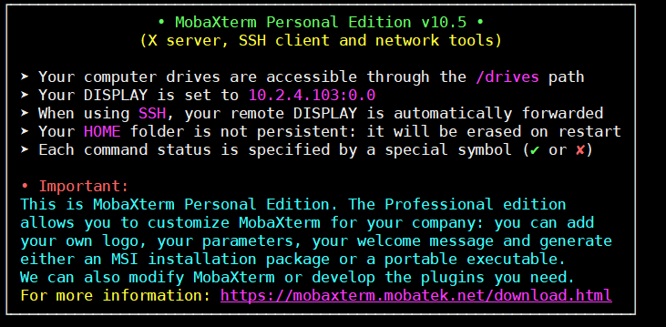

# Visual Studio Code for Docker (Reasonml)

Docker image to run Visual Studio Code inside a docker container. This image includes:
- [Linux](https://getgnulinux.org), [Debian](https://www.debian.org/index.en.html).
- The latest [Visual Studio Code](https://code.visualstudio.com/) release.
- Bunch of [Visual Studio Code extensions](https://marketplace.visualstudio.com/).
- Bs Platform installed.

## Running

- __Build the image__: Clone the repository and build the image using the next command: _docker build -t [desired_image_name] ._

- __Run the image previously built___: You can run the image previously build using the next command: _docker run --rm -e DISPLAY=[address of your display] -v "[desiredPathToMount]:[onVmPath]" [desired_image_name]_.

- __Run the image pulled from [Docker Hub](https://hub.docker.com/)__: _docker run --rm -e DISPLAY=[address of your display] -v "[desiredPathToMount]:[onVmPath]" nocountryforgeeks/vscode-reason_

__NOTE__: On Windows 10 machines:
  - It is needed to have a X-Server running. I recommended the [__MobaXTerm__](https://mobaxterm.mobatek.net/), that even can be run in a portable mode, without installing. You can get the _DISPALY_ setting opening a terminal:

  

## Installed extensions

- [__Auto Close Tags__](https://marketplace.visualstudio.com/items?itemName=formulahendry.auto-close-tag): Automatically add HTML/XML close tag
- [__Auto Import - ES6, TS, JSX, TSX__](https://marketplace.visualstudio.com/items?itemName=NuclleaR.vscode-extension-auto-import): Automatically finds, parses and provides code actions and code completion for all available imports. Works with JavaScript (ES6) and TypeScript (TS). Forker from old repo vscode-extension-auto-import
- [__Auto Rename Tag__](https://marketplace.visualstudio.com/items?itemName=formulahendry.auto-rename-tag): Automatically rename paired HTML/XML tag, same as Visual Studio IDE does.
- [__ESLint__](https://marketplace.visualstudio.com/items?itemName=dbaeumer.vscode-eslint): Integrates ESLint into VS Code.
- [__File Templates__](https://github.com/brpaz/vscode-file-templates-ext): Extenstion that allows to quickly create new files based on defined templates.
- [__Import cost __](https://marketplace.visualstudio.com/items?itemName=wix.vscode-import-cost): This extension will display inline in the editor the size of the imported package. The extension utilizes webpack with babili-webpack-plugin in order to detect the imported size.
- [__HTML CSS Support__](https://marketplace.visualstudio.com/items?itemName=ecmel.vscode-html-css): Missing CSS support for HTML documents.
- [__Indent rainbow__](https://marketplace.visualstudio.com/items?itemName=oderwat.indent-rainbow): This extension colorises the indentation in front of your text alternating four different colors on each step. Some may find it helpfull in writing code for Nim or Python.
- [__GraphQL for VSCode__](https://marketplace.visualstudio.com/items?itemName=kumar-harsh.graphql-for-vscode); VSCode extension for GraphQL schema authoring & consumption.
- [__Guides__](https://marketplace.visualstudio.com/items?itemName=spywhere.guides): A Visual Studio Code extension for more guide lines.
- [__Material Icon Theme__](https://marketplace.visualstudio.com/items?itemName=PKief.material-icon-theme): The Material Icon Theme provides lots of icons based on Material Design for Visual Studio Code.
- [__IntelliSense for CSS class names in HTML__](https://marketplace.visualstudio.com/items?itemName=Zignd.html-css-class-completion): A Visual Studio Code extension that provides CSS class name completion for the HTML class attribute based on the definitions found in your workspace or external files referenced through the link element.
- [__Rainbow Brackets__](https://marketplace.visualstudio.com/items?itemName=2gua.rainbow-brackets): Provide rainbow colors for the round brackets, the square brackets and the squiggly brackets. This is particularly useful for Lisp or Clojure programmers, and of course, JavaScript, and other programmers.
- [__Prettier - Code formatter__](https://marketplace.visualstudio.com/items?itemName=esbenp.prettier-vscode): VS Code package to format your JavaScript / TypeScript / CSS using Prettier.
- [__Docker__](https://marketplace.visualstudio.com/items?itemName=PeterJausovec.vscode-docker): The Docker extension makes it easy to build, manage and deploy containerized applications from Visual Studio Code.
- [__CSS Modules__](https://marketplace.visualstudio.com/items?itemName=clinyong.vscode-css-modules): Extension for CSS Modules, which supports: autocomplete, go to definition.
- [__Stylelint__](https://marketplace.visualstudio.com/items?itemName=shinnn.stylelint): A Visual Studio Code extension to lint CSS/SCSS/Less with stylelint.
- [__vscode-styled-components__](https://marketplace.visualstudio.com/items?itemName=jpoissonnier.vscode-styled-components): Syntax highlighting and IntelliSense for styled-components.
- [__vscode-styled-components-snippets__](https://marketplace.visualstudio.com/items?itemName=lXSPandora.vscode-styled-components-snippets): This extension contains code snippets and some triggers for JS Styled-Components.
- [__SVG Viewer__](https://marketplace.visualstudio.com/items?itemName=cssho.vscode-svgviewer): SVG Viewer for Visual Studio Code.
- [__Babel ES6/ES7__](https://marketplace.visualstudio.com/items?itemName=dzannotti.vscode-babel-coloring): Adds JS Babel es6/es7 syntax coloring.
- [__Color Highlight__](https://marketplace.visualstudio.com/items?itemName=naumovs.color-highlight): This extension styles css/web colors found in your document.
- [__EditorConfig for VS Code__](https://marketplace.visualstudio.com/items?itemName=EditorConfig.editorconfig): This plugin attempts to override user/workspace settings with settings found in .editorconfig files. No additional or vscode-specific files are required. As with any EditorConfig plugin, if root=true is not specified, EditorConfig will continue to look for an .editorconfig file outside of the project.
- [__TODO Highlight__](https://marketplace.visualstudio.com/items?itemName=wayou.vscode-todo-highlight): Highlight TODO,FIXME or any annotations within your code.
- [__Auto Complete Tag__](https://marketplace.visualstudio.com/items?itemName=formulahendry.auto-complete-tag): Combine the functions of Auto Close Tag and Auto Rename Tag
- [__ES7 React/Redux/GraphQL/React-Native snippets__](https://marketplace.visualstudio.com/items?itemName=dsznajder.es7-react-js-snippets): This extension provide you Javascript and React/Redux snippets in ES7 with babel plugins features for Vs Code.
- [__Markdown Preview Github Styling__](https://marketplace.visualstudio.com/items?itemName=bierner.markdown-preview-github-styles): hanges VS Code's built-in markdown preview to match Github's styling.
- [__TODO Parser__](https://marketplace.visualstudio.com/items?itemName=minhthai.vscode-todo-parser): Parse TODOs in your working files.
- [__Live HTML Previewer__](https://marketplace.visualstudio.com/items?itemName=hdg.live-html-previewer): This extension allows you to preview your html files in VS Code itself. Use it to quickly set the html and css right for your webpages.
- [__Quokka.js__](https://marketplace.visualstudio.com/items?itemName=WallabyJs.quokka-vscode): Live Scratchpad for JavaScript.
- [__markdownlint__](https://marketplace.visualstudio.com/items?itemName=DavidAnson.vscode-markdownlint): Markdown linting and style checking for Visual Studio Code.
- [__React Native Tools__](https://marketplace.visualstudio.com/items?itemName=vsmobile.vscode-react-native): This extension provides a development environment for React Native projects. Using this extension, you can debug your code, quickly run react-native commands from the command palette, and use IntelliSense to browse objects, functions and parameters for React Native APIs.
- [__Debugger for Chrome__](https://marketplace.visualstudio.com/items?itemName=msjsdiag.debugger-for-chrome): A VS Code extension to debug your JavaScript code in the Google Chrome browser, or other targets that support the Chrome DevTools Protocol.
- [__Code Runner__](https://marketplace.visualstudio.com/items?itemName=formulahendry.code-runner): Run code snippet or code file for multiple languages: C, C++, Java, JavaScript, PHP, Python, Perl, Perl 6, Ruby, Go, Lua, Groovy, PowerShell, BAT/CMD, BASH/SH, F# Script, F# (.NET Core), C# Script, C# (.NET Core), VBScript, TypeScript, CoffeeScript, Scala, Swift, Julia, Crystal, OCaml Script, R, AppleScript, Elixir, Visual Basic .NET, Clojure, Haxe, Objective-C, Rust, Racket, AutoHotkey, AutoIt, Kotlin, Dart, Free Pascal, Haskell, Nim, D, and custom command.
- [__npm Intellisense__](https://marketplace.visualstudio.com/items?itemName=christian-kohler.npm-intellisense): Visual Studio Code plugin that autocompletes npm modules in import statements.
- [__Node modules navigation__](https://marketplace.visualstudio.com/items?itemName=gegeke.node-modules-navigation): Provides definitions for commonjs requires in your code for quick navigation. Works with commonjs modules and import module system.
- [__npm__](https://marketplace.visualstudio.com/items?itemName=eg2.vscode-npm-script): npm support for VS Code
- [__OCaml and Reason IDE__](https://marketplace.visualstudio.com/items?itemName=freebroccolo.reasonml): Reason support for Visual Studio Code
